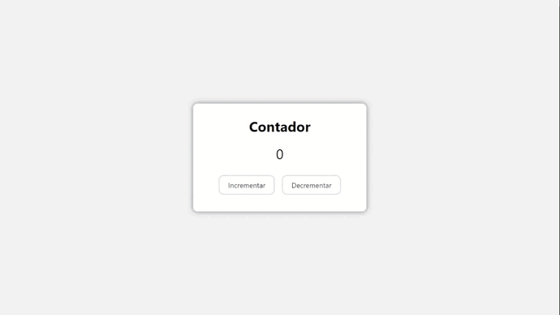

# Practica 01 | Contador

#### Crea un contador con dos botones, uno de incremento y otro de decremento

> __Condicion:__ El contador no admite numeros negativos

#### Tecnologias utilizadas:

  

Página web desplegada: [Contador][contador]

[contador]: https://iamdanihdz.github.io/DEVF-JS-Contador/

[Regresar al menú de prácticas][practicas]

[practicas]: https://github.com/iamDaniHdz/DEVF-Intro-JavaScript/tree/master/practicas
